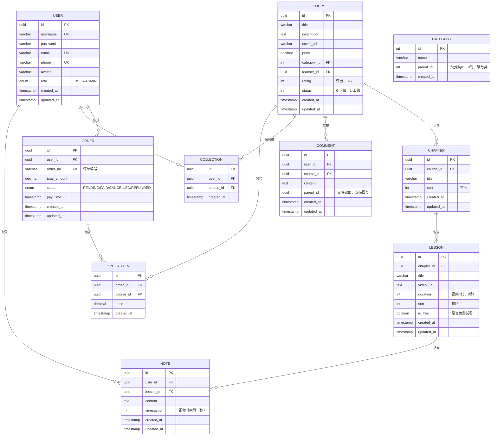

## 数据库设计

### 4.1 ER 图（Mermaid 语法）




### 4.2 核心数据表建表 SQL

#### 4.2.1 用户表（user）

```
CREATE TABLE "user" (
    id UUID PRIMARY KEY DEFAULT gen_random_uuid(),
    username VARCHAR(50) NOT NULL UNIQUE,
    password VARCHAR(255) NOT NULL,
    email VARCHAR(100) UNIQUE,
    phone VARCHAR(20) UNIQUE,
    avatar VARCHAR(255) DEFAULT '/avatar/default.png',
    role VARCHAR(20) NOT NULL DEFAULT 'USER' CHECK (role IN ('USER', 'ADMIN')),
    created_at TIMESTAMP NOT NULL DEFAULT CURRENT_TIMESTAMP,
    updated_at TIMESTAMP NOT NULL DEFAULT CURRENT_TIMESTAMP
);

-- 创建索引
CREATE INDEX idx_user_username ON "user"(username);
CREATE INDEX idx_user_email ON "user"(email);
```

#### 4.2.2 课程表（course）

```
CREATE TABLE course (
    id UUID PRIMARY KEY DEFAULT gen_random_uuid(),
    title VARCHAR(100) NOT NULL,
    description TEXT NOT NULL,
    cover_url VARCHAR(255) NOT NULL,
    price DECIMAL(10, 2) NOT NULL DEFAULT 0.00,
    category_id INT NOT NULL,
    teacher_id UUID NOT NULL,
    rating INT NOT NULL DEFAULT 0 CHECK (rating BETWEEN 0 AND 5),
    status INT NOT NULL DEFAULT 0 CHECK (status IN (0, 1)), -- 0-下架，1-上架
    created_at TIMESTAMP NOT NULL DEFAULT CURRENT_TIMESTAMP,
    updated_at TIMESTAMP NOT NULL DEFAULT CURRENT_TIMESTAMP
);

-- 创建索引
CREATE INDEX idx_course_category ON course(category_id);
CREATE INDEX idx_course_teacher ON course(teacher_id);
CREATE INDEX idx_course_status ON course(status);
```

#### 4.2.3 章节表（chapter）

```
CREATE TABLE chapter (
    id UUID PRIMARY KEY DEFAULT gen_random_uuid(),
    course_id UUID NOT NULL REFERENCES course(id) ON DELETE CASCADE,
    title VARCHAR(100) NOT NULL,
    sort INT NOT NULL DEFAULT 0,
    created_at TIMESTAMP NOT NULL DEFAULT CURRENT_TIMESTAMP,
    updated_at TIMESTAMP NOT NULL DEFAULT CURRENT_TIMESTAMP
);

-- 创建索引
CREATE INDEX idx_chapter_course ON chapter(course_id);
```

#### 4.2.4 课时表（lesson）

```
CREATE TABLE lesson (
    id UUID PRIMARY KEY DEFAULT gen_random_uuid(),
    chapter_id UUID NOT NULL REFERENCES chapter(id) ON DELETE CASCADE,
    title VARCHAR(100) NOT NULL,
    video_url VARCHAR(255) NOT NULL,
    duration INT NOT NULL DEFAULT 0, -- 视频时长（秒）
    sort INT NOT NULL DEFAULT 0,
    is_free BOOLEAN NOT NULL DEFAULT FALSE,
    created_at TIMESTAMP NOT NULL DEFAULT CURRENT_TIMESTAMP,
    updated_at TIMESTAMP NOT NULL DEFAULT CURRENT_TIMESTAMP
);

-- 创建索引
CREATE INDEX idx_lesson_chapter ON lesson(chapter_id);
```

#### 4.2.5 订单表（order）

```
CREATE TABLE "order" (
    id UUID PRIMARY KEY DEFAULT gen_random_uuid(),
    user_id UUID NOT NULL REFERENCES "user"(id) ON DELETE CASCADE,
    order_no VARCHAR(50) NOT NULL UNIQUE,
    total_amount DECIMAL(10, 2) NOT NULL,
    status VARCHAR(20) NOT NULL DEFAULT 'PENDING' CHECK (status IN ('PENDING', 'PAID', 'CANCELLED', 'REFUNDED')),
    pay_time TIMESTAMP,
    created_at TIMESTAMP NOT NULL DEFAULT CURRENT_TIMESTAMP,
    updated_at TIMESTAMP NOT NULL DEFAULT CURRENT_TIMESTAMP
);

-- 创建索引
CREATE INDEX idx_order_user ON "order"(user_id);
CREATE INDEX idx_order_order_no ON "order"(order_no);
CREATE INDEX idx_order_status ON "order"(status);
```